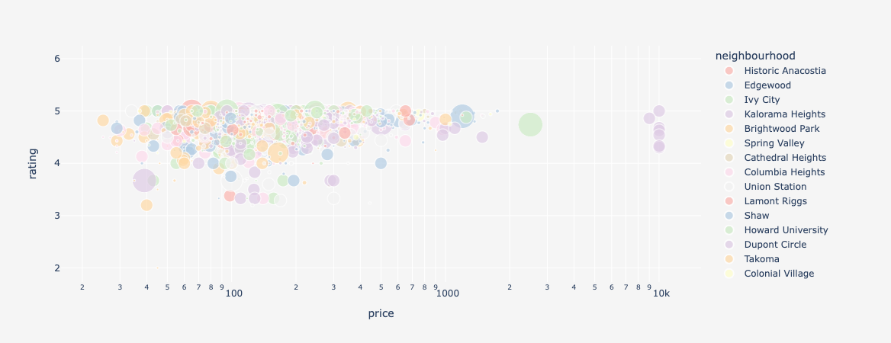
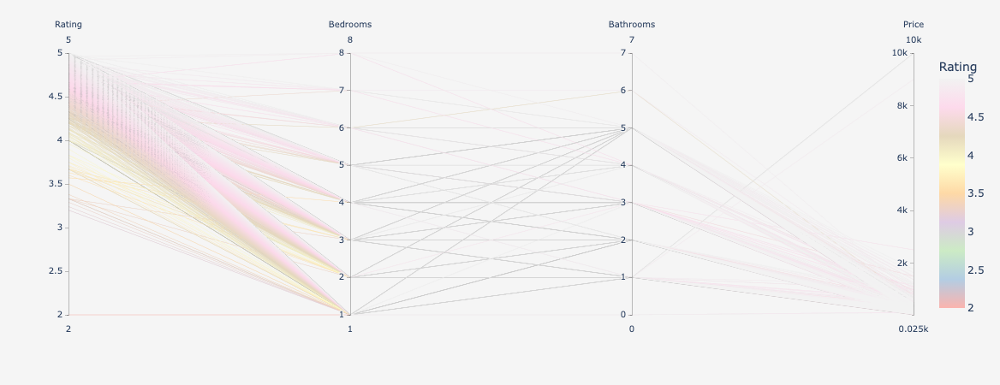

<script src="https://cdn.plot.ly/plotly-latest.min.js"></script>


```js
const df = FileAttachment("data/listings_cleaned.csv").csv()
```

# Plots

```js
// get unique neighbourhoods
const neighbourhoods = [...new Set(df.map(row => row.neighbourhood))];
// create a color map using the neighbourhoods
const colorMap = {};
neighbourhoods.forEach((neighbourhood, i) => {
  colorMap[neighbourhood] = i;
});
const data = [{
  type: 'scatter',
  mode: 'markers',
  x: df.map(row => row.price),
  y: df.map(row => row.rating),
  text: df.map(row => row.neighbourhood), // hover text
  marker: {
    size: df.map(row => row.minimum_nights),
    color: df.map(row => colorMap[row.neighbourhood]), // set color to an array/list of data
    colorscale: 'Viridis', // You can specify your own color scale
    sizemode: 'area',
    sizeref: 1,
  },
  transforms: [{
    type: 'sort',
    target: 'y',
    order: 'descending'
  }]
}];

const layout = {
  xaxis: {
    type: 'log',
    title: 'Price'
  },
  yaxis: {
    title: 'Rating'
  },
  plot_bgcolor: 'whitesmoke',
  paper_bgcolor: 'whitesmoke',
  margin: { t: 0 } // optional: reduce space on the top of the plot
};
const myDiv = display(document.createElement("mydiv"));
Plotly.newPlot(myDiv, data, layout);
```
## Price vs Rating



## Rating factors

